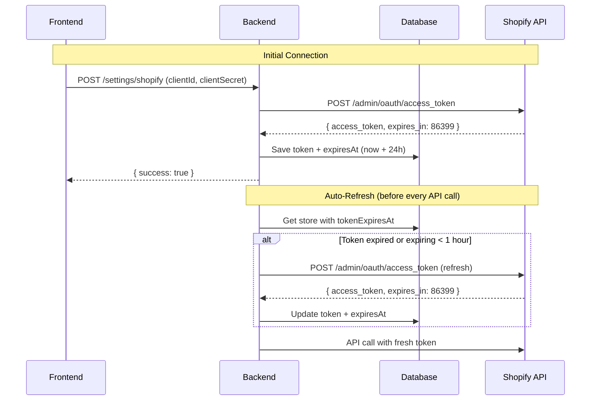

# 🛍️ Shopify Integration Setup Guide (2026 Method)

## 📝 What Changed in Shopify 2026?

Shopify has updated their authentication approach for better security:

### ❌ **Old Method (Deprecated):**
- Manually create and copy `shpat_xxx` access token
- Token never expires (security risk)
- Manual renewal required

### ✅ **New Method (2026 - Implemented):**
- Use **Client ID** + **Client Secret** from Partners Dashboard
- System automatically exchanges them for access tokens
- Tokens auto-refresh every 24 hours
- More secure and maintainable

---

## 🚀 Step-by-Step Connection Guide

### **Step 1: Find Your Credentials**

You already have these from Shopify Partners Dashboard:

```
Client ID: YOUR_SHOPIFY_CLIENT_ID
Client Secret (App Secret Key): YOUR_SHOPIFY_CLIENT_SECRET
```

**Where to find them again:**
1. Go to https://partners.shopify.com/
2. Click **Apps** in sidebar
3. Click **ConvoSell CRM** (your app)
4. Click **Configuration** tab
5. **Client ID** is shown at the top
6. **Client Secret / App Secret Key** is under "App credentials" section

---

### **Step 2: Get Your Store Domain**

Your development store domain format: `your-dev-store.myshopify.com`

**To find it:**
1. Partners Dashboard → **Stores**
2. Find your development store "ConvoSell"
3. The domain shows next to the store name

**Note:** Use the `.myshopify.com` domain, NOT the custom domain if you set one.

---

### **Step 3: Start ConvoSell Services**

Before connecting Shopify, make sure all services are running:

#### **Option A: PowerShell Script (Recommended)**
```powershell
.\start-dev.ps1
```

#### **Option B: Manual Start**
```powershell
# Start Docker (PostgreSQL + Redis)
docker-compose up -d

# Wait 10 seconds for database to start
Start-Sleep -Seconds 10

# Run database migration (NEW - adds client credentials)
cd backend
npx prisma migrate dev --name shopify_client_credentials
cd ..

# Start Backend
cd backend
npm run start:dev &
cd ..

# Start Worker
cd worker
npm run start:dev &
cd ..

# Start Frontend
cd frontend
npm run dev
```

---

### **Step 4: Run Database Migration**

**IMPORTANT:** This adds the new client credentials fields to the database.

```powershell
cd backend
npx prisma migrate dev --name shopify_client_credentials
```

You should see:
```
✔ Applying migration `20XX_shopify_client_credentials`
✔ Generated Prisma Client
```

---

### **Step 5: Connect Shopify in ConvoSell**

1. Open ConvoSell: http://localhost:3001
2. Login with your account
3. Go to **Settings** (gear icon in sidebar)
4. Click **Shopify** tab
5. Fill in the form:

   **Shop Domain:**
   ```
   your-dev-store.myshopify.com
   ```

   **Client ID:**
   ```
   YOUR_SHOPIFY_CLIENT_ID
   ```

   **Client Secret / App Secret Key:**
   ```
   YOUR_SHOPIFY_CLIENT_SECRET
   ```

   **API Scopes:** (leave default)
   ```
   read_orders,write_orders,read_customers,write_customers
   ```

6. Click **Connect Shopify Store**

---

### **Step 6: What Happens After Clicking Connect?**

ConvoSell will automatically:

1. ✅ Send credentials to backend
2. ✅ Backend exchanges them with Shopify:
   ```
    POST https://your-dev-store.myshopify.com/admin/oauth/access_token
   Body: {
       "grant_type": "client_credentials",
       "client_id": "YOUR_SHOPIFY_CLIENT_ID",
       "client_secret": "YOUR_SHOPIFY_CLIENT_SECRET"
   }
   ```
3. ✅ Shopify returns access token (shpat_xxx)
4. ✅ Token saved in database with expiry time (24 hours)
5. ✅ Success message shown: "Shopify store connected successfully!"

**From now on:**
- Access tokens will automatically refresh before they expire
- You never need to manually copy tokens again
- Just keep your Client ID and Secret secure

---

## 🔧 Testing the Integration

### **1. Configure Webhooks in Shopify**

1. Go to your Shopify Partners Dashboard
2. **Apps** → **ConvoSell CRM** → **Configuration**
3. Scroll to **Webhooks** section
4. Add webhook:
   - **Topic:** Order creation (orders/create)
   - **URL:** `https://your-ngrok-url.ngrok.io/api/shopify/webhook/orders/create`
   - **Format:** JSON

### **2. Create Test Order**

1. Log into your Shopify store admin (partners.shopify.com → Stores → ConvoSell → "Log in")
2. Go to **Orders** → **Create order**
3. Add test customer with WhatsApp number:
   - Name: Test Customer
   - Phone: +923001234567 (Pakistani number format)
   - Email: test@example.com
4. Add a product
5. Click **Create order**

### **3. Verify in ConvoSell**

1. Go to ConvoSell → **Contacts**
2. Customer should appear automatically
3. Go to **Orders**
4. Order should be listed
5. Check **Automations** if you set up WhatsApp verification messages

---

## 🐛 Troubleshooting

### **Error: "Failed to authenticate with Shopify"**

**Causes:**
- Wrong Client ID or Client Secret
- Store domain incorrect (must be `.myshopify.com`)
- App not installed on the store

**Solution:**
1. Double-check credentials from Partners Dashboard → Apps → ConvoSell CRM → Configuration
2. Ensure domain format: `yourstore.myshopify.com`
3. Make sure app is installed: Partners Dashboard → Apps → ConvoSell CRM → Test your app

---

### **Error: "Client ID not found"**

**Cause:** App doesn't have Client ID generated yet

**Solution:**
1. Partners Dashboard → Apps → ConvoSell CRM
2. If Client ID is blank:
   - Go to **Configuration** tab
   - Scroll to **App credentials**
   - Click **Generate client credentials**
3. Copy the newly generated credentials

---

### **Token Not Refreshing**

**Symptoms:** API calls fail after 24 hours

**Solution:**
1. Check backend logs: `cd backend; npm run start:dev`
2. Look for: `Refreshing Shopify token for workspace ...`
3. If not appearing, the `getShopifyAccessToken` method should auto-refresh
4. Manually test by making an API call to Shopify after 24 hours

---

### **Webhook Not Received**

**Causes:**
- Webhook URL incorrect (not using ngrok)
- Firewall blocking requests
- Webhook secret mismatch

**Solution:**
1. Start ngrok: `ngrok http 3000`
2. Update webhook URL in Shopify with ngrok URL
3. Check backend logs for incoming webhooks
4. Verify `SHOPIFY_WEBHOOK_SECRET` in `.env` matches Shopify

---

## 📊 Token Refresh Flow (Technical)



---

## 🎉 Success Checklist

After setup, you should have:

- ✅ Client ID and Client Secret saved in database
- ✅ Access token automatically generated (you never see it)
- ✅ Token expiry tracked (refreshes automatically)
- ✅ Shopify webhooks configured and receiving events
- ✅ Orders syncing from Shopify to ConvoSell
- ✅ Contacts created from customers
- ✅ WhatsApp verification messages working

---

## 📚 Additional Resources

- **Shopify 2026 Docs:** https://shopify.dev/docs/apps/build/authentication-authorization/client-secrets
- **Shopify Partners:** https://partners.shopify.com/
- **Development Stores:** Free unlimited for testing
- **API Rate Limits:** 2 requests/second for standard plan

---

## 🆘 Need Help?

If you encounter issues:

1. Check backend logs: `ConvoSell is listening on http://localhost:3000`
2. Check database migration ran: `npx prisma studio` → ShopifyStore table should have `clientId`, `clientSecret`, `tokenExpiresAt` columns
3. Verify credentials match exactly (no extra spaces)
4. Test connection: The app will show detailed error messages

**Common Fix:** Re-save credentials if connection fails initially
